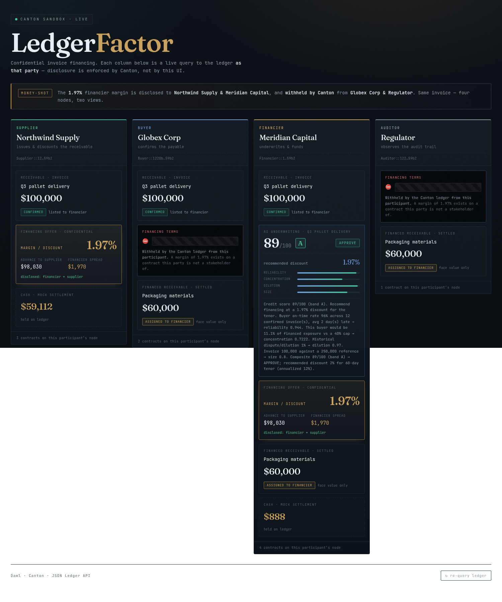
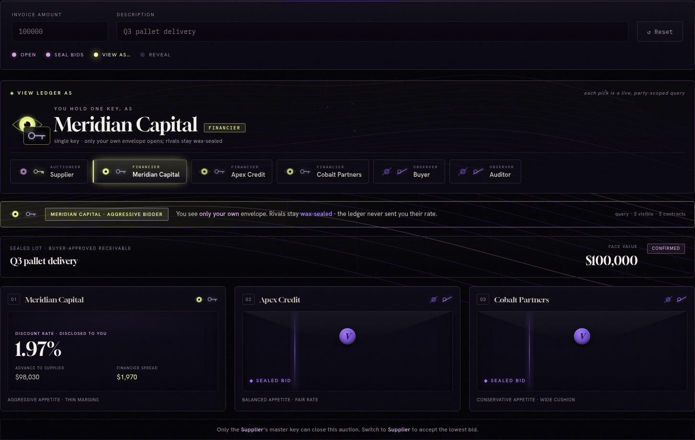

# LedgerFactor

Confidential invoice financing on Canton. A supplier discounts a buyer-approved
invoice to a financier, the financier's margin is hidden from the buyer **by the
protocol**, and the ledger **structurally** guarantees one invoice can never be
financed twice. An AI agent underwrites the receivable over only the data the
financier is entitled to see.

Built for HackCanton S2, track **Real-World Asset (RWA) & Business Workflows**: the
invoice is the asset, and the demo runs its full lifecycle (issuance, state changes,
transfer, fulfillment, audit) as a workflow an organization could actually run.
Business brief: [docs/business-brief.md](docs/business-brief.md).

**Live:** https://ledgerfactor.unitynodes.com - an interactive guided demo: create an
invoice and step it through issue → confirm → list → AI-underwrite → offer → settle,
watching the four participant nodes update live. Persistent systemd services behind
Caddy + Cloudflare; see [docs/deploy.md](docs/deploy.md).



## Why this runs only on Canton

Three guarantees are enforced by the ledger, not by the UI:

1. **Selective disclosure (margin privacy).** The discount rate lives on
   `FinancingProposal` / `FinancingOffer`, whose only stakeholders are the
   financier and supplier. The buyer is never a stakeholder, so the margin never
   reaches the buyer's participant node.
2. **Single-exercise uniqueness (anti-double-pledge).** The `Invoice` is one
   authoritative contract; `AcceptFinancing` is a *consuming* choice, so a second
   financing attempt on the same invoice is rejected at the ledger.
3. **Atomic DvP.** Assigning the receivable and paying the supplier the discounted
   cash settle in a single transaction.

## Architecture

```
 web/ (React + Vite)  ──/api──▶  server/ (Node + Express)  ──JSON API──▶  Canton sandbox
 four role screens               party-scoped views                        (Daml contracts)
                                 + AI credit-scoring agent
```

- **`daml/`** - the model and the Daml Script proofs. This is the core.
- **`server/`** - Node gateway. Holds per-party JWTs, exposes party-scoped
  `/api/view/:role`, and runs the credit-scoring agent (`server/src/scoring/`).
- **`web/`** - the "same invoice, four screens" dashboard. Each column is a live
  query to the ledger *as that party*; the margin card appears only where the
  ledger discloses it.

## The two money-shots (proven, not asserted)

Daml Script tests in [daml/Tests.daml](daml/Tests.daml), each querying the ledger
as its own party:

- `testSelectiveDisclosure` - the buyer queries for `FinancingOffer` /
  `FinancingProposal` and gets **nothing**; financier and supplier see the margin.
- `testNoDoubleFinancing` - two offers on one invoice; the first `AcceptFinancing`
  consumes it, the second is **rejected by the ledger**.
- `testHappyPathSettlement` - atomic DvP: supplier paid 97,000 on a 100,000 invoice
  at 3%, original receivable gone, auditor sees face value only.

```
daml/Tests.daml:testSelectiveDisclosure: ok, 2 active contracts, 4 transactions.
daml/Tests.daml:testNoDoubleFinancing:   ok, 5 active contracts, 11 transactions.
daml/Tests.daml:testHappyPathSettlement: ok, 3 active contracts, 7 transactions.
```

The same disclosure is verifiable live: query the running gateway as each party and
only supplier + financier see the discount rate.

```bash
for r in supplier buyer financier auditor; do curl -s localhost:8080/api/view/$r; done
```

## The AI credit-scoring agent

`server/src/scoring/` is a deterministic underwriting engine - not a chatbot. It
scores buyer payment reliability, portfolio concentration, and dilution risk into a
0-100 credit score and risk band, and recommends a discount rate. The financier
reviews and signs the resulting on-ledger offer. An LLM turns the structured
rationale into a short memo; with no API key it falls back to a deterministic memo,
so the demo never depends on a network call. 5/5 unit tests: `npm --prefix server test`.

## Run it

Prerequisites: Daml SDK 2.10.4 and a JDK (17 works), Node 20+.

```bash
# 1. prove the core (no services needed)
daml test

# 2. run the whole stack (sandbox + JSON API + server + web)
./scripts/dev.sh
# → UI on http://localhost:5173
```

## Veild - sealed-bid auction (second mode)

Toggle **Sealed auction · Veild** on the live site for a multi-financier blind
auction. A supplier auctions one invoice to three financiers who each submit a
**blind bid**; the killer property - enforced by Canton sub-transaction privacy -
is that **no financier can see another's bid**, only the supplier (auctioneer) sees
them all. The **View as…** control re-queries the ledger as each party: as a
financier only your own envelope opens (rivals stay wax-sealed); as the supplier
every envelope opens; the buyer/auditor see no pricing. On close the lowest bid
wins and settles atomically. Proven on-ledger by `testSealedBidAuction`
([daml/Tests.daml](daml/Tests.daml)) and served from `server/src/server.ts`
(`/api/auction/*`) + [web/src/AuctionBoard.tsx](web/src/AuctionBoard.tsx).



This is impossible on a public chain, where sealed bids would leak via logs before
the reveal.

## Honest scope

- **Mock cash.** `Cash` is an owner-signed bearer token standing in for a
  token-standard holding. The DvP *atomicity* is real; the cash model is not
  production-grade. Real token-standard DvP is a stretch goal.
- **Notified factoring.** Listing an invoice reveals the financier's identity to
  the buyer; the sensitive figure - the pricing - stays hidden. Undisclosed
  factoring (hiding the financier too) would use Canton explicit disclosure.

## Status

- [x] Daml model + both money-shots proven by Daml Script
- [x] AI credit-scoring agent (rules engine + optional LLM memo), unit-tested
- [x] Live JSON API gateway + party-scoped role views
- [x] Four-role frontend (supplier / buyer / financier / auditor)
- [x] Business brief + pilot plan
- [x] Persistent deployment (systemd + Caddy) at ledgerfactor.unitynodes.com
- [x] **Veild** - sealed-bid auction mode (multi-financier blind auction)
- [ ] Real token-standard DvP settlement (stretch)
- [ ] Runtime compliance citation via CCPEDIA MCP in the auditor view (stretch)
